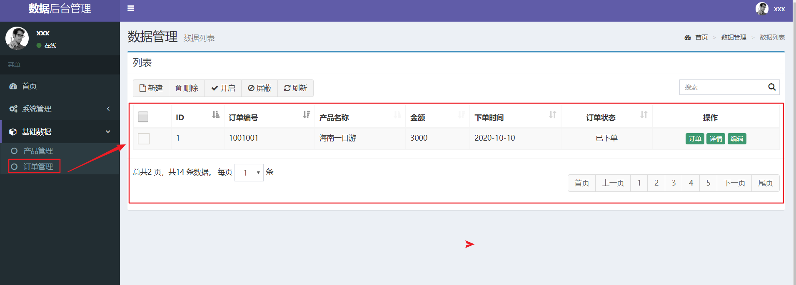
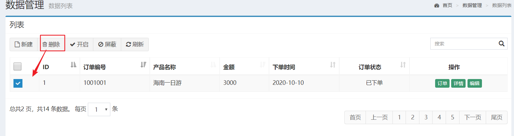

# 项目实战需求-后台管理系统

## 一、项目涉及技术

1、前端技术

JSP    JavaScript   Ajax   JSTL

2、数据库

mysql

3、框架

mybatis

4、后端

Servlet

## 二、数据库表关系

## 三、需求

### 3.1 登录功能

1、实现登录

2、实现记住状态，下次自动登录

3、进入主界面后，展示登录者信息

4、修改用户密码及注销功能

5、登录安全认证实现：非登录用户不得访问工程其他资源

### 3.2 用户管理

1、点击用户管理，实现遍历所有用户（带分页功能实现）

2、点击新建按钮，弹出新增页面，实现新增操作

3、点击删除按钮，实现删除选中复选框数据功能

4、点击更改角色按钮，弹出对应记录角色信息，实现更改用户角色功能

5、点击详情按钮，实现查看当前用户详细信息（页面自己制作）

6、点击状态实现状态切换

7、搜索功能

### 3.3 角色管理

1、点击角色管理，遍历所有角色信息

2、点击新建按钮，弹出新建页面

点击保存，实现新增角色信息

3、点击删除按钮实现删除选中复选框数据

4、点击更改权限资源按钮，弹出权限资源页面

点击保存实现更改资源权限

### 3.4 资源权限管理

1、点击资源权限管理，实现遍历所有资源权限

2、点击新建按钮，弹出新增页面

点击保存实现新增功能

3、删除功能实现

### 3.5 日志管理（扩展）

1、点击访问日志，实现遍历所有日志信息

2、点击删除按钮，实现删除复选框选中数据

3、点击导出按钮，实现当前页数据备份功能

4、搜索

​      按照访问时间模糊搜索，功能如用户管理中搜索

### 3.6 产品管理

1、点击产品管理，实现产品遍历

2、点击新建按钮，弹出新建页面

点击保存实现产品新增功能

3、点击删除按钮，实现删除复选框选中数据

4、状态管理

点击开启/屏蔽，实现产品状态更改

5、点击编辑按钮，弹出编辑页面，实现数据回显

点击修改实现数据更新

### 3.7 订单管理

1、点击订单管理，实现遍历所有订单信息

2、点击删除按钮，实现删除复选框选中数据

3、点击订单详情按钮，弹出详情页面

实现数据回显

### 3.8 扩展功能

不同用户角色登录，左侧列表显示不同：

比如：

​	超级管理员用户登录，显示所有操作项

​	管理员用户登录，显示部分操作项...

## 四、项目完成结果要求

项目是一个整体，关联项要有关联操作，不是独立内容